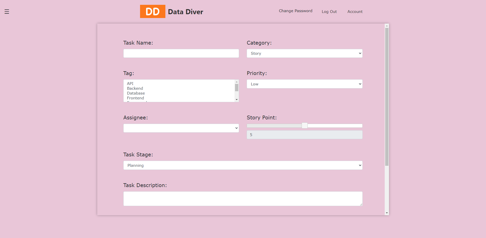
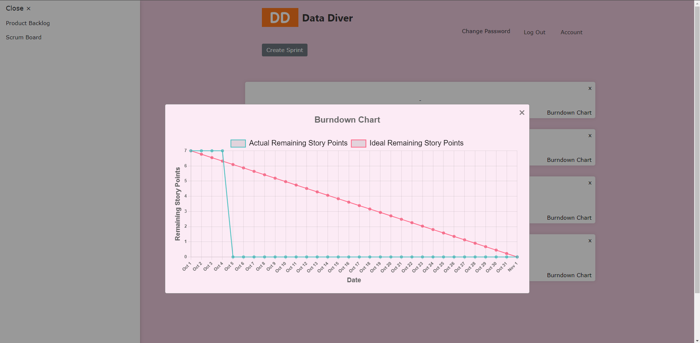
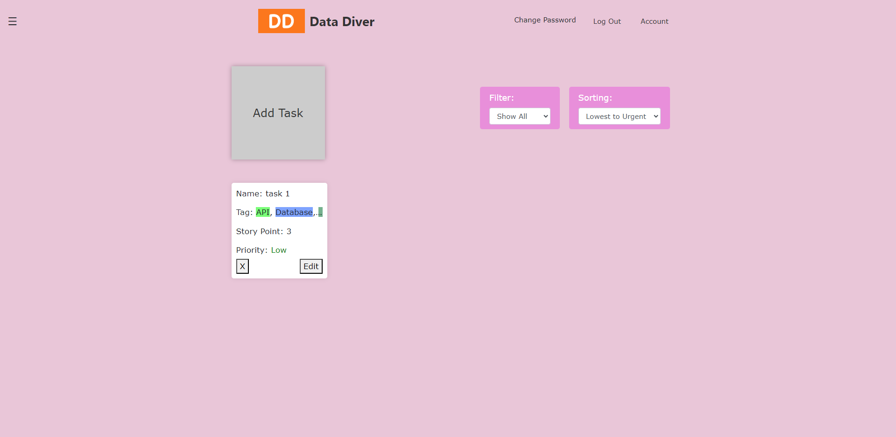
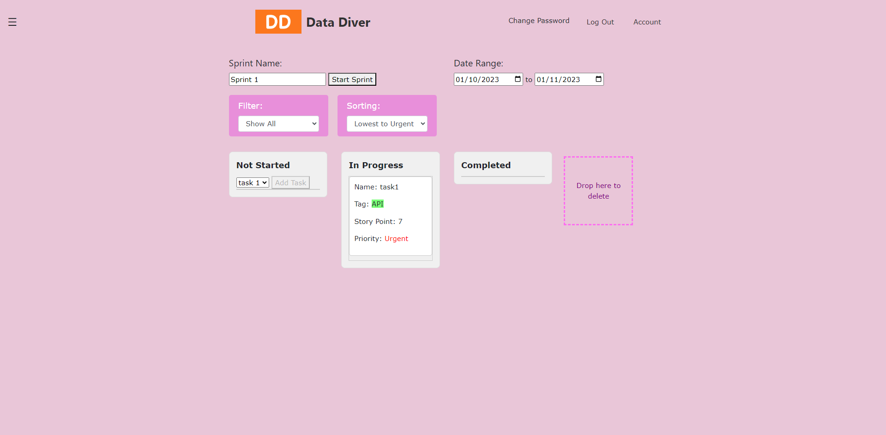
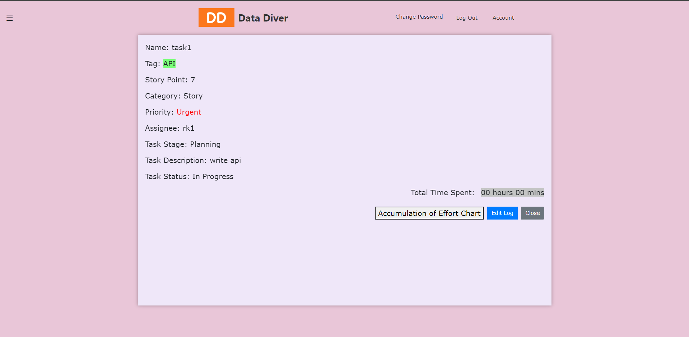

# DataDiver - Scrum Project Management Website

This project is developed as part of the coursework for FIT2101 - Software Engineering Process. It aims to provide a platform for managing Scrum projects effectively.

## Summary

- Served as project manager and backend developer within a team of six, adhering to Agile methodologies.
- Conducted business requirement elicitation with stakeholders, ensuring alignment with client objectives and user needs.
- Developed key features, including Product Backlogs, Scrum Boards, effort accumulation charts, and burndown charts.
- Integrated Firebase for real-time database management and user authentication.
- Designed custom user interfaces for Admins, project team members, and project managers, tailored to enhance user experience.

## Overview

This website facilitates project management using Scrum methodologies. It includes features for task management, sprint planning, user roles, and more.

## Features

### Product Backlog
- Manage and prioritize project requirements and user stories.

### Scrum Board
- Visualize and manage tasks in different stages of development.

### Burndown Chart
- Track project progress by showing remaining work over time.

### Accumulation of Effort Chart
- Display time spent by team members on project tasks.

### Sprint Planning
- Plan and organize tasks for upcoming sprints.

### Filter and Sorting Functionalities
- Easily sort and filter project tasks based on various criteria.

## Login Credentials

- **Username:** rk1
- **Password:** rk1

## Live Website

Explore the live deployment of the Scrum Project Management Website:
[Scrum Project Management Website](https://pbcrush22.github.io/scrum-project-management-website/login-mainpage.html)

## Figma Design

View the initial design concept on Figma for project visualization:
[Figma Design](https://www.figma.com/design/BC9PSADRFHmTJbLgD4ZNfe/Copy-for-Edward?node-id=0-1)

## Technologies Used

- HTML5, CSS3 for front-end development
- JavaScript for interactive features
- Firebase for backend and authentication

## Screenshots

### Add Task

### Burndown Chart

### Product Backlog

### Sprint Planning

### Task Log

